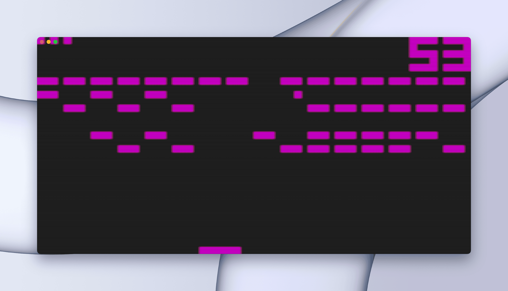
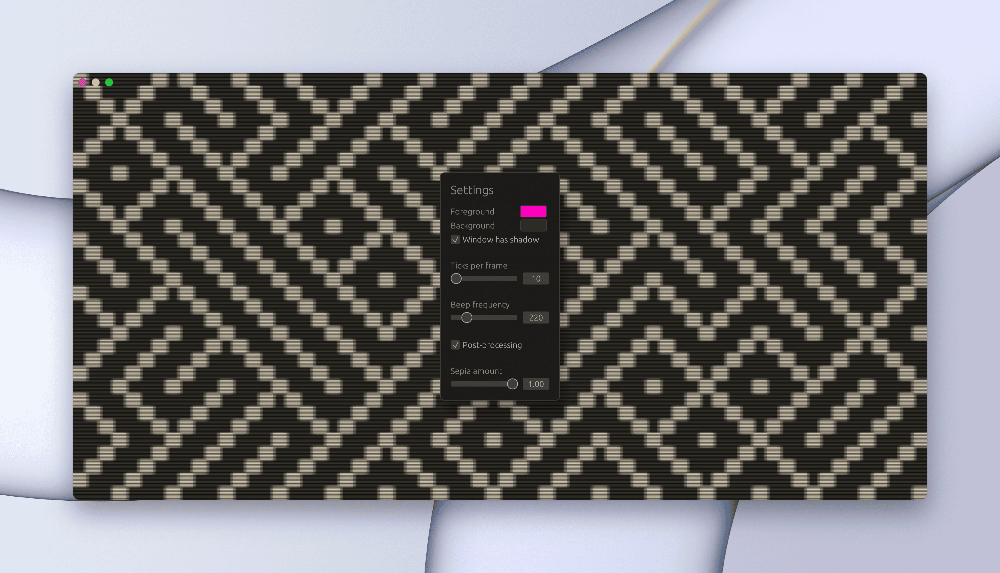
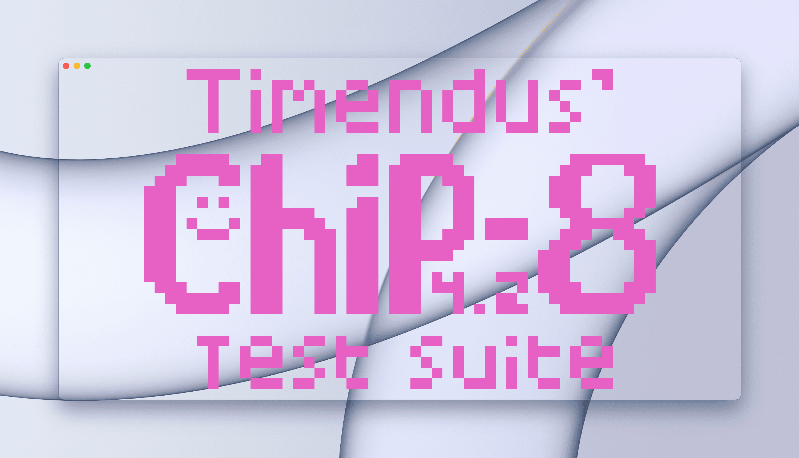

# yet another chip8 emulator


> Just another CHIP-8 emulator,  built as a way to learn Rust.<br>
> Draws stuff with wgpu and has some truly questionable post-processing effects.<br>
> Makes a beep (even without any clicks and pops).<br>

 
```
cargo build --release
./target/release/chip [ROM_PATH]
```




