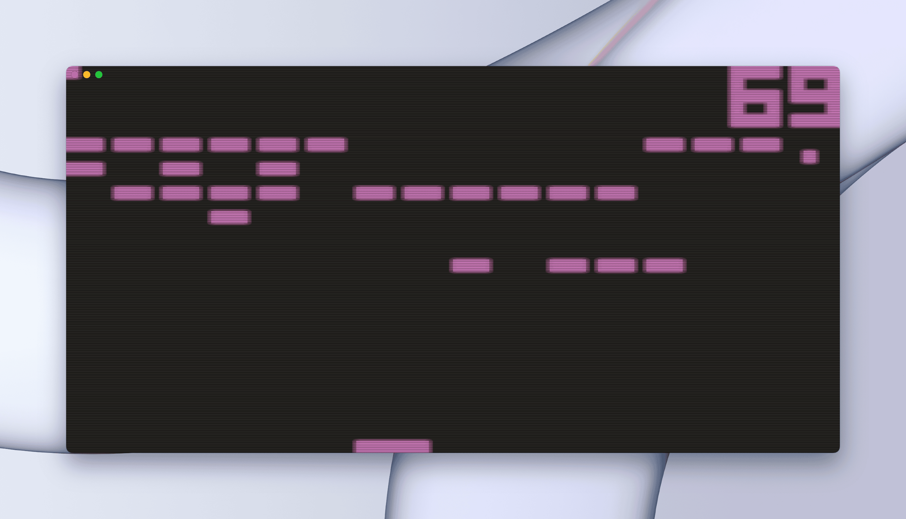

# yet another chip8 emulator


> Just another CHIP-8 emulator,  built as a way to learn Rust.<br>
> Draws stuff with wgpu and has some truly questionable post-processing effects.<br>
> Makes a beep (even without any clicks and pops).<br>

### Keys
- `;` - settings
- `esc` - exit

### Keypad mapping

|||||
|---|---|---|---|
| 1 | 2 | 3 | 4 |
| q | w | e | r |
| a | s | d | f |
| z | x | c | v |
 
```
cargo build --release
./target/release/chip [ROM_PATH]
```




